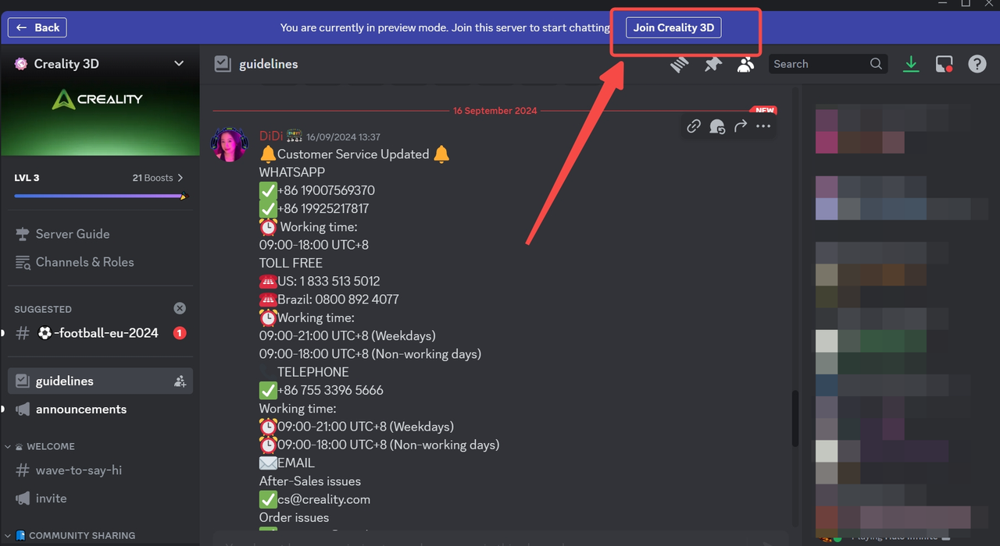
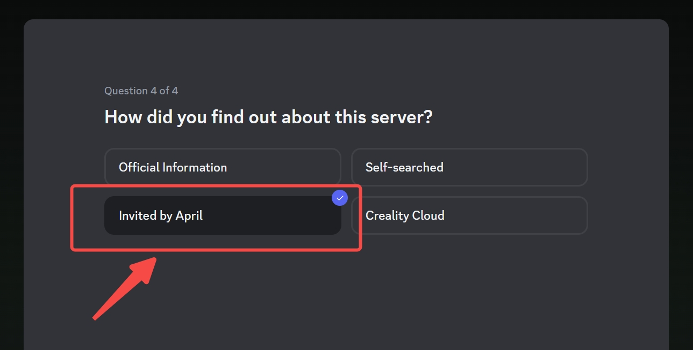
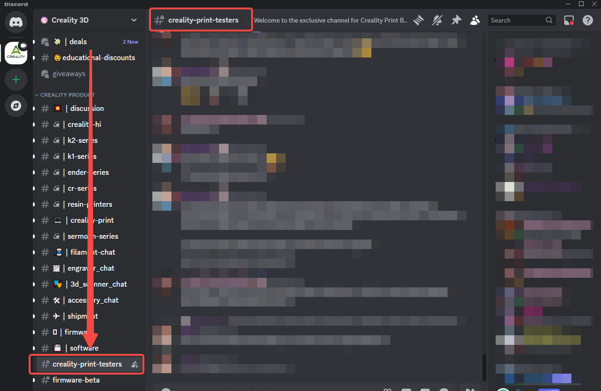

# Creality Print 6.0  
Creality Print 6.0 is an open source slicer for FDM printers.   [Offical Wiki](https://wiki.creality.com/en/software) 

# Join community

Welcome to join the Discord channel "creality-print-tester" and engage with us in discussions about everything related to Creality Print. Please follow the instructions below to help you find the "creality-print-tester" group.
- Click the "Join Creality 3D" button.

- At the 4th question select the “Invite by April” button.

- The left navigation bar shows all channels, scroll down until you find "creality-print-tester".



# Main features
- Auto calibrations for all printers
- Sandwich(inner-outer-inner) mode - an improved version of the `External perimeters first` mode
- Polyholes conversion support [SuperSlicer Wiki: Polyholes](https://github.com/supermerill/SuperSlicer/wiki/Polyholes)
- Klipper support
- More granular controls
- More features can be found in [change notes](https://github.com/CrealityOfficial/CrealityPrint/releases/)  


# Download

### Stable Release
📥 **[Download the Latest Stable Release](https://github.com/CrealityOfficial/CrealityPrint/releases/latest)**  
Visit our GitHub Releases page for the latest stable version of Creality Print, recommended for most users.


# How to install
**Windows**: 
1.  Download the installer for your preferred version from the [releases page](https://github.com/CrealityOfficial/CrealityPrint/releases).
    - *For convenience there is also a portable build available.*
    - *If you have troubles to run the build, you might need to install following runtimes:*
      - [MicrosoftEdgeWebView2RuntimeInstallerX64](https://github.com/SoftFever/OrcaSlicer/releases/download/v1.0.10-sf2/MicrosoftEdgeWebView2RuntimeInstallerX64.exe)
          - [Details of this runtime](https://aka.ms/webview2)
          - [Alternative Download Link Hosted by Microsoft](https://go.microsoft.com/fwlink/p/?LinkId=2124703)
      - [vcredist2019_x64](https://github.com/SoftFever/OrcaSlicer/releases/download/v1.0.10-sf2/vcredist2019_x64.exe)
          -  [Alternative Download Link Hosted by Microsoft](https://aka.ms/vs/17/release/vc_redist.x64.exe)
          -  This file may already be available on your computer if you've installed visual studio.  Check the following location: `%VCINSTALLDIR%Redist\MSVC\v142`

**Mac**:
1. Download the DMG for your computer: `arm64` version for Apple Silicon and `x86_64` for Intel CPU.  
2. Drag CrealityPrint.app to Application folder. 
3. *If you want to run a build from a PR, you also need following instructions below*  
    <details quarantine>
    - Option 1 (You only need to do this once. After that the app can be opened normally.):
      - Step 1: Hold _cmd_ and right click the app, from the context menu choose **Open**.
      - Step 2: A warning window will pop up, click _Open_  
      
    - Option 2:  
      Execute this command in terminal: `xattr -dr com.apple.quarantine /Applications/CrealityPrint.app`
      ```console
          softfever@mac:~$ xattr -dr com.apple.quarantine /Applications/CrealityPrint.app
      ```
    - Option 3:  
        - Step 1: open the app, a warning window will pop up  
              
        - Step 2: in `System Settings` -> `Privacy & Security`, click `Open Anyway`:  
              
    </details>
    
**Linux(Ubuntu)**:
 1. If you run into trouble to execute it, try this command in terminal:  
    `chmod +x /path_to_appimage/CrealityPrint_Linux.AppImage`
    
# How to compile
- Windows 64-bit  
  - Tools needed: Visual Studio 2019, Cmake, git, git-lfs, Strawberry Perl.
      - You will require cmake version 3.14 or later, which is available [on their website](https://cmake.org/download/).
      - Strawberry Perl is [available on their github repository](https://github.com/StrawberryPerl/Perl-Dist-Strawberry/releases/).
  - Run `build_release.bat` in `x64 Native Tools Command Prompt for VS 2019`
  - Note: Don't forget to run `git lfs pull` after cloning the repository to download tools on Windows

- Mac 64-bit  
  - Tools needed: Xcode, Cmake, git, gettext, libtool, automake, autoconf, texinfo
      - You can install most of them by running `brew install cmake gettext libtool automake autoconf texinfo`
  - run `build_release_macos.sh`
  - To build and debug in XCode:
      - run `XCode.app`
      - open ``build_`arch`/CrealityPrint.xcodeproj``
      - menu bar: Product => Scheme => CrealityPrint
      - menu bar: Product => Scheme => Edit Scheme...
          - Run => Info tab => Build Configuration: `RelWithDebInfo`
          - Run => Options tab => Document Versions: uncheck `Allow debugging when browsing versions`
      - menu bar: Product => Run

- Ubuntu 
  - Dependencies **Will be auto installed with the shell script**: `libmspack-dev libgstreamerd-3-dev libsecret-1-dev libwebkit2gtk-4.0-dev libosmesa6-dev libssl-dev libcurl4-openssl-dev eglexternalplatform-dev libudev-dev libdbus-1-dev extra-cmake-modules libgtk2.0-dev libglew-dev libudev-dev libdbus-1-dev cmake git texinfo`
  - run 'sudo ./BuildLinux.sh -u'
  - run './BuildLinux.sh -dsir'


# Note: 
If you're running Klipper, it's recommended to add the following configuration to your `printer.cfg` file.
```
# Enable object exclusion
[exclude_object]

# Enable arcs support
[gcode_arcs]
resolution: 0.1
```

# Supports
**Creality Print** is an open-source project, and I'm deeply grateful to all my sponsors and backers.   
Their generous support enables me to purchase filaments and other essential 3D printing materials for the project.   
Thank you! :)


## Some background
Creality Print is originally forked from [Orca Slicer](https://github.com/SoftFever/OrcaSlicer) by SoftFever
Orca Slicer is forked from [Bambu Studio](https://github.com/bambulab/BambuStudio) by Bambu
Bambu Studio is forked from [PrusaSlicer](https://github.com/prusa3d/PrusaSlicer) by Prusa Research, which is from [Slic3r](https://github.com/Slic3r/Slic3r) by Alessandro Ranellucci and the RepRap community. 
Creality Print incorporates a lot of features from SuperSlicer by @supermerill
Creality Print's logo is designed by community member Justin Levine(@freejstnalxndr)  


# License
Creality Print is licensed under the GNU Affero General Public License, version 3. Creality Print is based on Orca Slicer by Orca Slicer.

Orca Slicer is licensed under the GNU Affero General Public License, version 3. Creality Print is based on Bambu Studio by BambuLab.

Bambu Studio is licensed under the GNU Affero General Public License, version 3. Bambu Studio is based on PrusaSlicer by PrusaResearch.

PrusaSlicer is licensed under the GNU Affero General Public License, version 3. PrusaSlicer is owned by Prusa Research. PrusaSlicer is originally based on Slic3r by Alessandro Ranellucci.

Slic3r is licensed under the GNU Affero General Public License, version 3. Slic3r was created by Alessandro Ranellucci with the help of many other contributors.

The GNU Affero General Public License, version 3 ensures that if you use any part of this software in any way (even behind a web server), your software must be released under the same license.

Creality Print includes a pressure advance calibration pattern test adapted from Andrew Ellis' generator, which is licensed under GNU General Public License, version 3. Ellis' generator is itself adapted from a generator developed by Sineos for Marlin, which is licensed under GNU General Public License, version 3.

The bambu networking plugin is based on non-free libraries from Bambulab. It is optional to the Creality Print and provides extended functionalities for Bambulab printer users.

test
